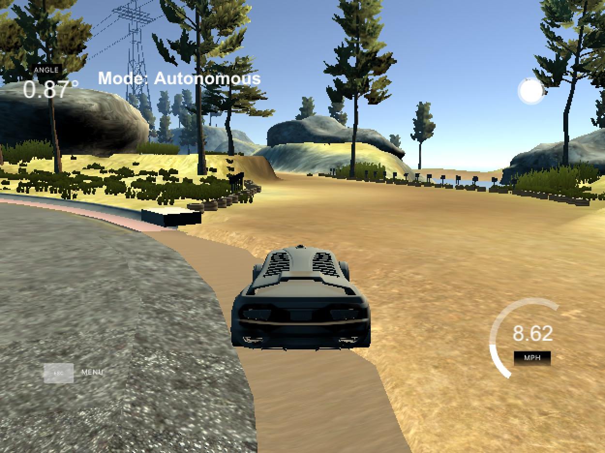
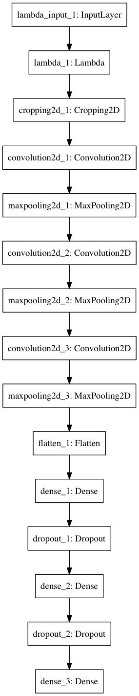
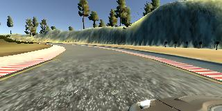
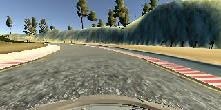
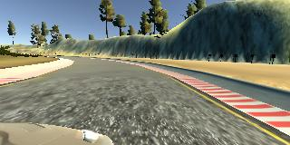
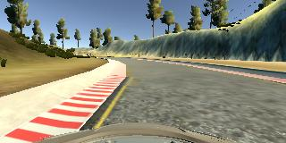
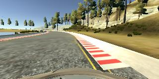

#**Behavioral Cloning** 

---

Yangchun Luo

Nov 9, 2017

This is the assignment for Udacity's Self-Driving Car Term 1 Project 3.

---

**Behavioral Cloning Project**

The goals / steps of this project are the following:

* Use the simulator to collect data of good driving behavior
* Build, a convolution neural network in Keras that predicts steering angles from images
* Train and validate the model with a training and validation set
* Test that the model successfully drives around track one without leaving the road
* Summarize the results with a written report


## Rubric Points
###Here I will consider the [rubric points](https://review.udacity.com/#!/rubrics/432/view) individually and describe how I addressed each point in my implementation.  

---
###Files Submitted & Code Quality

####1. Submission includes all required files and can be used to run the simulator in autonomous mode

My project includes the following files:

* model.py containing the script to create and train the model
* drive.py for driving the car in autonomous mode
* model.h5 containing a trained convolution neural network 
* README.md (this file) summarizing the results

####2. Submission includes functional code
Using the Udacity provided simulator and drive.py file, the car can be driven autonomously around the track by executing 
```
python drive.py model.h5
```

####3. Submission code is usable and readable

The model.py file contains the code for loading training data, and training and saving the convolution neural network. The file shows the pipeline I used for training and validating the model, and it contains comments to explain how the code works.

###Model Architecture and Training Strategy

####1. An appropriate model architecture has been employed

My model consists of a convolution neural network with 5x5 filter sizes and depths of 6, 16, and 32 (model.py lines 71-77).

The model also contains three fully connected layers with sizes of 120, 84, and 1 (model.py lines 78-83).

The model includes RELU activation function to introduce nonlinearity, except for the output layer (model.py lines 80 and 82).

Data is normalized in the model using a Keras lambda layer (model.py line 68). The input image is also cropped to area that best represent the road condition (model.py line 70).

####2. Attempts to reduce overfitting in the model

The model contains two dropout layers in order to reduce overfitting (model.py lines 81 and 83), with dropout rate 0.5, each after a fully-connected layer.

The model was trained and validated on different data sets to ensure that the model was not overfitting (model.py lines 94-98). The split rate is 80%-20% for training and validation. The model was tested by running it through the simulator and ensuring that the vehicle could stay on the track.

####3. Model parameter tuning

The model used an ADAM optimizer, so the learning rate was not tuned manually (model.py line 87).

####4. Appropriate training data

Training data was collected by driving on the center of the road, as well as recovering from both sides of the road. When driving on center, left and right camera images were used as additional training data with an empirical correction value to the steering angle.

A couple lessons learned during collecting driving data:

- Use mouse to steer the vehicle for a finer-grained steering angles.
- Keep the speed between 10-15 mph so that the chance for oversteering and correction is small. It also matches the target speed in autonomous mode.
- Create multiple directories to restore the data for different purposes. In this way, a bad training run can be easily separated out and not "pollute" the entire training set.

For details about how I created the training data, see the later section. 

###Model Architecture and Training Strategy

####1. Solution Design Approach

The overall strategy for deriving a model architecture was to able to map the features of a camera image toward the front of the road to the best steering angle of the vehicle.

My first step was to use a convolution neural network model similar to the LeNet (i.e. two layers of 5x5 convolution with depth 6 and 16, respectively), since stacking the convolution and max-pooling layers to proven to be able to extract proper image features.

The first model had both low training and validation error. It worked okay for a short distance when applied to autonomous driving on the track. It got off the road at a major curve later. Another point of confusion came from the following point after the bridge, where the right side seemed to be a legitimate road as well:



It suggested that I'd need more training data, a more powerful model, as well as ways to mitigate overfitting.

- To increase the modeling power of the network, I added the third layer of convolution and max-pooling, and set the depth to 32, to learn some even higher level representation of the road features.

- I employed two layers of dropouts, one after each fully-connected layer--an experience learned from the previous project. The keep rate is to set 0.5 since it is in middle of the network (i.e. not input signals). Keras should do the right thing to set the keep rate to 1 when evaluating the model--effectively removing the dropout layers. I increased the training epochs to 10 as a result.

At the end of the process, also in combination of more training data and data augmentation (see later section), the vehicle is able to drive autonomously around the track without leaving the road.

####2. Final Model Architecture

The final model architecture (model.py build_model function) consisted of a convolution neural network with the following layers and layer sizes:


| Layer         		|     Description	        | 
|:-----------------:|:---------------------------------------------:| 
| Input         		| 160x320x3 RGB image   | 
| Lambda (Normalization) | outputs 160x320x3   | 
| Cropping			| outputs 60x320x3
| Convolution 5x5   | 1x1 stride, valid padding, outputs 56x316x6, RELU|
| Max pooling	      	| 2x2 stride,  outputs 28x158x6 |
| Convolution 5x5   | 1x1 stride, valid padding, outputs 24x154x16, RELU|
| Max pooling	      	| 2x2 stride,  outputs 12x77x16 |
| Convolution 5x5   | 1x1 stride, valid padding, outputs 8x73x32, RELU|
| Max pooling	      	| 2x2 stride,  outputs 4x36x32 |
| Fully connected   | input 4608 (4x36x32), outputs 120, RELU |
| Dropout           | rate 0.5 |
| Fully connected   | input 120, outputs 84, RELU |
| Dropout           | rate 0.5 |
| Fully connected   | input 84, outputs 1 |


Here is a visualization of the architecture using the built-in plot function in Keras.



####3. Creation of the Training Set & Training Process

Training data was collected in the following manners:

* **Center-forward**: driving in counterclockwise direction, keeping the vehicle at center of the road, for two laps.
* **Center-backward**: driving in clockwise direction, keeping the vehicle at center of the road, for one lap.
* **Left-recovery**: driving in counterclockwise direction, recovering from left side of the road, for a couple of locations.
* **Right-recovery**: driving in counterclockwise direction, recovering from right side of the road, for a couple of locations.

For **Center-forward** and **Center-backward** data, both left and right camera images were used with an empirical correction value (0.2) to the steering angle.

|  |  | 
|:-----------------:|:---------------------------------------------:|:---|
| Left, correction +0.2 | Center, no correction | Right, correction -0.2

While these side cameras can help the model learn how to steer away from either side of the road, I also explicitly collected driving data by manually doing the same thing (**Left-recovery** and **Right-recovery**). Only center camera images were used in these cases.

|  |  |
|:-----------------:|:---------------------------------------------:|
| Left recovery | Right recovery |


All the *center* camera images are augmented by flipping the image along the X axis and reversing the steering angle (multiplied by -1.0). This creates additional dataset for training and validation.

Overall, there were a total of 33072 samples (including augmentation). At each epoch, 20% of the samples were used for validation and the rest for model fitting. I tried a total of 10 epochs, which is evidenced by the diminishing decrease of validation cost. I used an ADAM optimizer so that manually training the learning rate wasn't necessary.

```
26457/26457 [==============================] - 60s - loss: 0.0156 - val_loss: 0.0105
Epoch 2/10
26457/26457 [==============================] - 57s - loss: 0.0111 - val_loss: 0.0086
Epoch 3/10
26457/26457 [==============================] - 57s - loss: 0.0099 - val_loss: 0.0082
Epoch 4/10
26457/26457 [==============================] - 57s - loss: 0.0090 - val_loss: 0.0076
Epoch 5/10
26457/26457 [==============================] - 57s - loss: 0.0084 - val_loss: 0.0071
Epoch 6/10
26457/26457 [==============================] - 56s - loss: 0.0079 - val_loss: 0.0068
Epoch 7/10
26457/26457 [==============================] - 57s - loss: 0.0076 - val_loss: 0.0069
Epoch 8/10
26457/26457 [==============================] - 57s - loss: 0.0071 - val_loss: 0.0066
Epoch 9/10
26457/26457 [==============================] - 57s - loss: 0.0068 - val_loss: 0.0065
Epoch 10/10
26457/26457 [==============================] - 57s - loss: 0.0066 - val_loss: 0.0067
```
